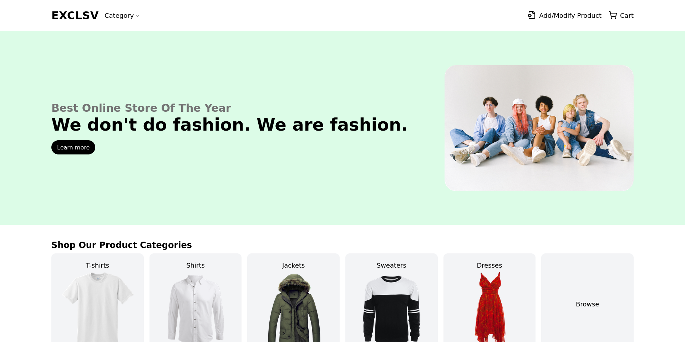
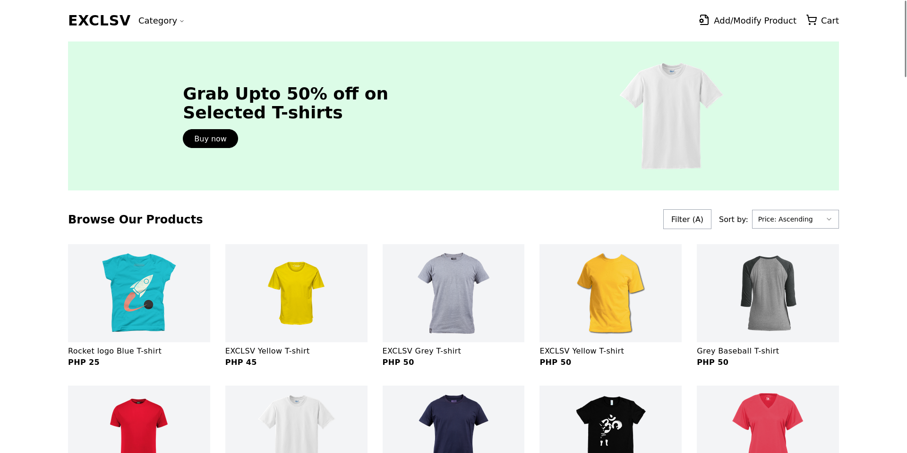
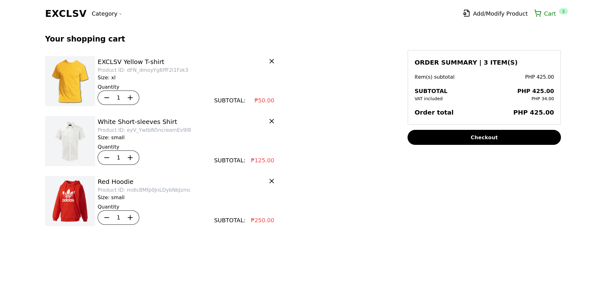
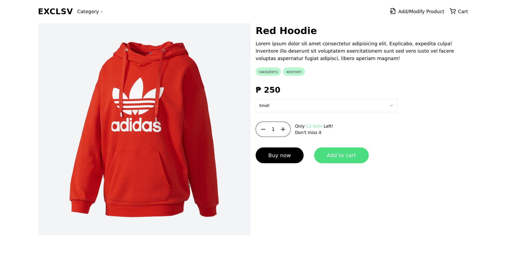
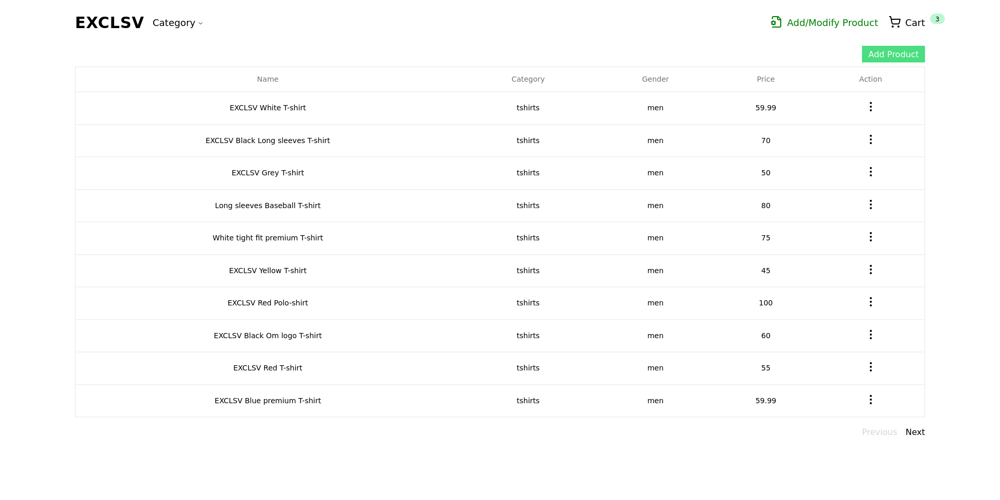
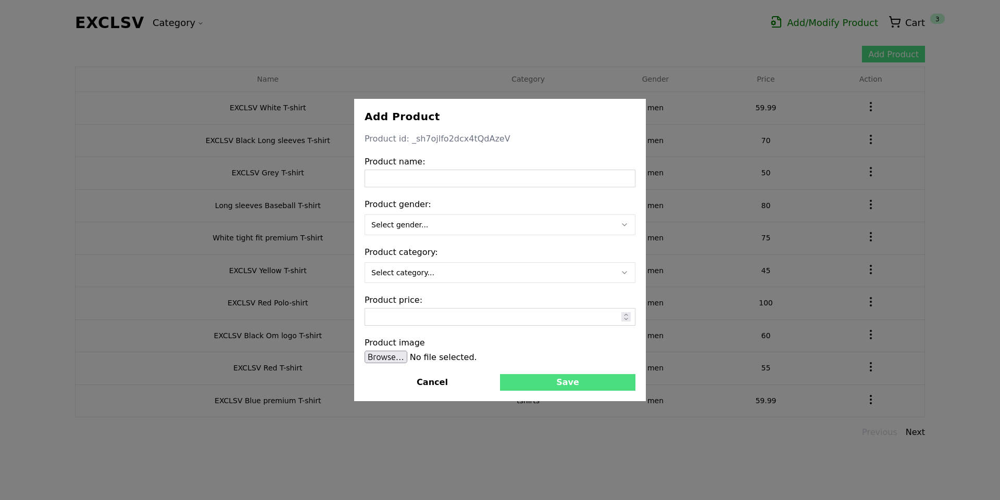
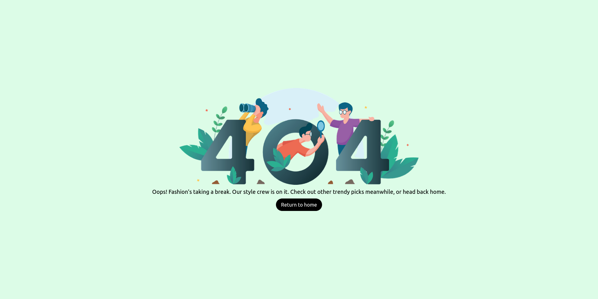

# React + TypeScript + Vite
Introducing a full-stack web application developed with cutting-edge technologies, this project leverages Vite, React, Tailwind CSS, and TypeScript for the frontend, while the backend is powered by Express using a simple file-based approach for data storage.

Key Technologies Used:

    Frontend:
        Vite
        React
        Tailwind CSS
        TypeScript

    Backend:
        Express with a file-based storage approach

Development Accelerators:

    Shadcn-ui
    multer
    zustand
    lucide-react

To enhance the development experience, nodemon and concurrently are employed to facilitate rapid reloads of the API during code changes, enabling seamless development for both the backend and frontend

# Usage Instructions:
1. Clone the repository.
2. Install dependencies.
3. Run npm run dev or pnpm run dev, depending on your preferred package manager.

Prerequisites:
Ensure that PORT 3000 is available, and use Node version v20.9.0.

# To do
- Test the application
- Containerize the application using Docker

# Screenshot

# Conclusion:
This fully functional full-stack web application embraces modern technologies, fostering efficient development and a user-friendly UI design. While testing is pending, updates to the repository are anticipated.
